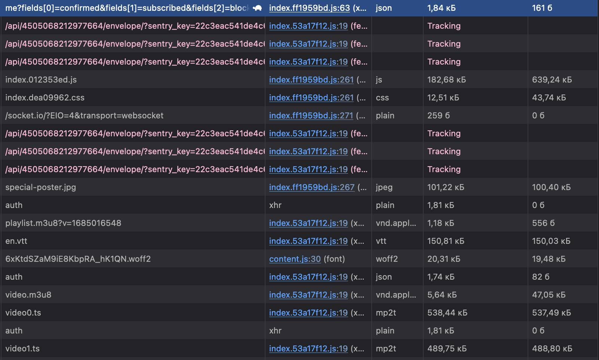

# 

На сайте можно приобрести доступ к платным видеоматериалам и просматривать их через встроенный плеер.

При загрузке страницы с плеером на неоплаченной учетной записи происходит запрос, который содержит данные пользователя и флаг `subscribed`. До оплаты этот флаг имеет значение `false`, после оплаты — `true`:

```json
{
    "id": 594250,
    "confirmed": true,
    "subscribed": false,
    "blocked": false,
    "email": "mail@site.com",
    "name": "mwefi",
    "hasPendingTransaction": false
}
```


Если перехватить запрос неоплаченной сессии и изменить значение `subscribed` на `true`, сервис неожиданно запускает внутренний скрипт, который устанавливает соединение по вебсокету для аутентификации потока-плейлиста m3u8.




При попытке обратиться к плейлисту потока через `ffmpeg`, сервер возвращает ошибку `403`:


Как было сказано ранее, для аутентификации доступа к плейлисту необходимо использовать вебсокет (возможно, требуются дополнительные действия). Чтобы оперативно получить доступ, нужно собрать поток, пока вебсокет открыт.

В консоли браузера, пока вебсокет открыт, необходимо запустить JavaScript-скрипт, который будет циклично собирать или загружать поток по фрагментам `.ts`.

После получения всех фрагментов, их можно объединить в мастер-файл:
```
fflite -f concat -safe 0 -i list.txt -c copy -map 0 master.mov
```
На выходе получится мастер-файл с исходным качеством 4K (качество потоков), а также добавленн субтитрами.


## Решение

Для устранения необходимо реализовать проверку подлинности флага `subscribed` на стороне сервера и не полагаться исключительно на данные из клиентских запросов (корректный тонкий клиент). 
Это предотвратит подмену значения флага и несанкционированный доступ к платным видеоматериалам.